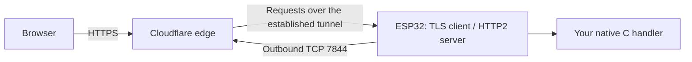

<a id="readme-top"></a>

[![CI][ci-shield]][ci-url]
[![Release][release-shield]][release-url]
[![License][license-shield]][license-url]
[![Issues][issues-shield]][issues-url]

<br />
<div align="center">
  <a href="https://github.com/frxbg/esp-cf-tunnel">
    
  </a>
  <h3 align="center">ESP Cloudflare Tunnel</h3>
  <p align="center">
    A native C library that connects your ESP32 application directly to a named Cloudflare Tunnel.
    <br />
    <a href="docs/integration.md"><strong>Explore the docs »</strong></a>
    <br /><br />
    <a href="examples/system_monitor">System Monitor example</a>
    &middot;
    <a href="https://github.com/frxbg/esp-cf-tunnel/issues/new?template=bug_report.yml">Report Bug</a>
    &middot;
    <a href="https://github.com/frxbg/esp-cf-tunnel/issues/new?template=feature_request.yml">Request Feature</a>
  </p>
</div>

<details>
  <summary>Table of Contents</summary>
  <ol>
    <li><a href="#about-the-project">About The Project</a></li>
    <li><a href="#built-with">Built With</a></li>
    <li><a href="#getting-started">Getting Started</a></li>
    <li><a href="#usage">Usage</a></li>
    <li><a href="#testing">Testing</a></li>
    <li><a href="#roadmap">Roadmap</a></li>
    <li><a href="#contributing">Contributing</a></li>
    <li><a href="#license">License</a></li>
    <li><a href="#contact">Contact</a></li>
    <li><a href="#acknowledgments">Acknowledgments</a></li>
  </ol>
</details>

## About The Project

Expose a native ESP-IDF HTTP handler through Cloudflare using an outbound
connection from the device. There is no Linux host, Go runtime, gateway, Worker
or local TCP proxy in the firmware.



**Experimental, single-connection implementation.** The native monitor has been
tested on an ESP32-S3 with a real named tunnel. ESP32-P4 is compile-tested only.
This project is not affiliated with Cloudflare and does not implement the full
`cloudflared` feature set. The internal tunnel protocol can change upstream.

| Included | Current limit |
|---|---|
| Named, remotely managed tunnels | One public hostname and one exact service label |
| DNS discovery, verified TLS, HTTP/2, registration | IPv4; one edge connection |
| Native request/response callbacks | Two or four application slots; bounded allocations |
| Reconnect, retry backoff, retained diagnostics | No failover across parallel edge connections |
| System Monitor example | English UI, AP setup, Wi-Fi scan, telemetry, password unlock, GPIO/RGB |
| Host tests and ESP-IDF compile matrix | See [validation](docs/validation.md) for tested and untested paths |

WebSockets, SSE, QUIC, WARP and a general HTTP origin proxy are not implemented.
The dashboard may show **Degraded** because this connector has one edge
connection. See [compatibility](docs/compatibility.md).

### Built With

- [ESP-IDF v6.1](https://github.com/espressif/esp-idf/tree/v6.1) and native C11
- [nghttp2](https://nghttp2.org/) for HTTP/2 and HPACK
- [cJSON](https://github.com/DaveGamble/cJSON) with private symbols and bounded allocation
- [cloudflared](https://github.com/cloudflare/cloudflared) as the pinned protocol reference

Exact versions, commits and scopes are in [dependencies.lock.json](dependencies.lock.json).

<p align="right">(<a href="#readme-top">back to top</a>)</p>

## Getting Started

### Prerequisites

- ESP-IDF **6.1.0** with the toolchain for ESP32-S3 or ESP32-P4.
- Working networking and a valid system clock in your application.
- A named Cloudflare Tunnel, its **connector token**, and a configured hostname.
- Outbound DNS and TCP **7844** access. The monitor also needs SNTP.

An account API key is not a tunnel connector token. Keep credentials outside
source control; supply them from your application's provisioning/storage layer.

### Installation

Add a Git dependency to your application's `main/idf_component.yml`:

```yaml
dependencies:
  esp_cf_tunnel:
    git: https://github.com/frxbg/esp-cf-tunnel.git
    path: components/esp_cf_tunnel
    version: v0.3.2
```

Enable the transport in `sdkconfig.defaults`:

```ini
CONFIG_CF_TUNNEL_ESP_TRANSPORT=y
CONFIG_MBEDTLS_SSL_IN_CONTENT_LEN=16384
```

Alternatively, copy `components/esp_cf_tunnel` into your project's `components`
directory. The component includes its C sources, public CA certificates and
third-party licenses. No recursive submodules are required.

The library is distributed through GitHub; it is **not currently published in
the ESP Component Registry**.

## Usage

Include `esp_cf_tunnel.h`, provide networking/clock, credential and native backend
callbacks, then call `esp_cf_tunnel_init()` and `esp_cf_tunnel_start()`.
Use `esp_cf_tunnel_get_snapshot()` for status and `esp_cf_tunnel_reload()` after
updating credentials. The [integration guide](docs/integration.md) explains
callback ownership, stream lifetime, authentication and shutdown.

For a working application, start with [System Monitor](examples/system_monitor/README.md):

```sh
git clone https://github.com/frxbg/esp-cf-tunnel.git
cd esp-cf-tunnel
# Activate ESP-IDF v6.1 first.
python tools/build_monitor.py --profile yd_s3
```

The example targets the YD-ESP32-23 with 16 MiB flash and optional 8 MiB PSRAM.
Generate your own device password and follow the [first-install instructions](docs/system-monitor.md)
before flashing. No reusable credentials or configured NVS images are supplied.

For the monitor's public hostname, select **HTTP** and **localhost:80** in
Cloudflare, followed by the fallback `http_status:404` rule. Here `localhost:80`
identifies the native handler; the firmware does not open a loopback connection.
Configure Cloudflare Access separately and keep device-password authentication
enabled for administration. See [security](SECURITY.md).

## Testing

```sh
cmake -S . -B build-host
cmake --build build-host --config Debug
ctest --test-dir build-host -C Debug --output-on-failure
```

On Linux/WSL, run the sanitizer suites:

```sh
sh tools/test_host.sh
sh tools/test_h2.sh
sh tools/test_monitor_remote.sh
```

The [contributing guide](CONTRIBUTING.md) covers the ESP32-S3/P4 compile matrix,
independent Go RPC oracle and publication checks. Tests use synthetic credentials.
The [memory budget](docs/memory-budget.md) separates measured RAM from allocation limits.

<p align="right">(<a href="#readme-top">back to top</a>)</p>

## Roadmap

- [x] Verified TLS, HTTP/2 and named-tunnel registration
- [x] Native monitor, authenticated settings and reconnect diagnostics
- [x] Bounded streaming, host sanitizers and S3/P4 compile profiles
- [x] Standalone ESP-IDF component and GitHub distribution
- [ ] Long-duration hardware and multi-client load testing
- [ ] Full deferred inbound backpressure and broader HTTP interoperability
- [ ] WebSocket/SSE support and an optional local HTTP backend
- [ ] Multi-edge support with measured RAM requirements

See [open issues](https://github.com/frxbg/esp-cf-tunnel/issues) and
[compatibility](docs/compatibility.md) for current limits.

## Contributing

Read [CONTRIBUTING.md](CONTRIBUTING.md), create a focused branch, run the relevant
checks and open a pull request. Include a reproducible case with sanitized logs.
Report security issues privately using [SECURITY.md](SECURITY.md).

## License

Project code is distributed under the **MIT License**. See [LICENSE](LICENSE).
Vendored dependencies retain their own licenses; see [THIRD_PARTY_NOTICES](THIRD_PARTY_NOTICES).

## Contact

Maintainer: [frxbg](https://github.com/frxbg)

Project: [github.com/frxbg/esp-cf-tunnel](https://github.com/frxbg/esp-cf-tunnel)

## Acknowledgments

- [Best-README-Template](https://github.com/othneildrew/Best-README-Template) for this README's structure
- [Cloudflare](https://github.com/cloudflare/cloudflared) for the protocol reference
- [Espressif](https://github.com/espressif/esp-idf), [nghttp2](https://github.com/nghttp2/nghttp2), and [cJSON](https://github.com/DaveGamble/cJSON)
- [YD-ESP32-23 board documentation](https://github.com/rtek1000/YD-ESP32-23)

<p align="right">(<a href="#readme-top">back to top</a>)</p>

[ci-shield]: https://github.com/frxbg/esp-cf-tunnel/actions/workflows/ci.yml/badge.svg
[ci-url]: https://github.com/frxbg/esp-cf-tunnel/actions/workflows/ci.yml
[release-shield]: https://img.shields.io/github/v/release/frxbg/esp-cf-tunnel?include_prereleases
[release-url]: https://github.com/frxbg/esp-cf-tunnel/releases
[license-shield]: https://img.shields.io/github/license/frxbg/esp-cf-tunnel
[license-url]: LICENSE
[issues-shield]: https://img.shields.io/github/issues/frxbg/esp-cf-tunnel
[issues-url]: https://github.com/frxbg/esp-cf-tunnel/issues
